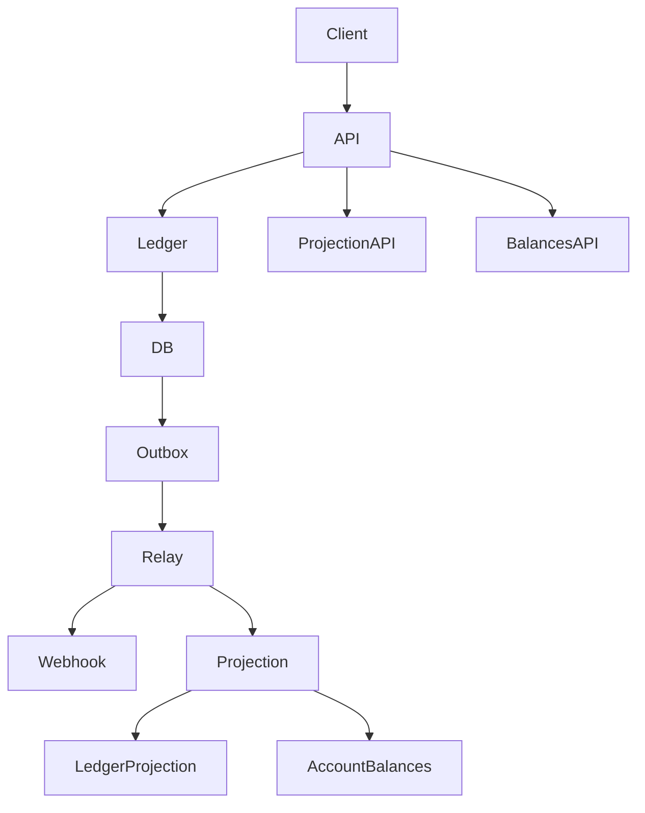

# AGENTS — adaptive-financial-os

## Agents (10)

| # | Agent | File | Role |
|---|-------|------|------|
| 1 | Ledger Agent | apps/api/src/ledger/ledger.service.ts | Post entry + balance validation + idempotency |
| 2 | Balance Agent | packages/accounting-core/src/balance.ts | AccountBalance + TrialBalance + projectionDeltas |
| 3 | Outbox Relay | apps/outbox-relay/src/relay/outbox-relay.service.ts | Poll + claim + publish + project |
| 4 | Projection Service | apps/outbox-relay/src/relay/projection.service.ts | ledger_projection + account_balances upsert |
| 5 | Webhook Publisher | apps/outbox-relay/src/relay/outbox.publisher.ts | HTTP POST to WEBHOOK_URL, fallback log |
| 6 | Database Agent | apps/api/src/database/database.service.ts | pg.Pool + RLS + transaction |
| 7 | Health Agent | apps/api/src/health/health.controller.ts | Liveness + DB ping |
| 8 | Posting Agent | packages/accounting-core/src/posting.ts | Balanced entry validation |
| 9 | Money Agent | packages/accounting-core/src/money.ts | NUMERIC(20,4) handling |
| 10 | API Controller | apps/api/src/ledger/ledger.controller.ts | REST endpoints |

## Flow



## How to Extend

- Add new ledger endpoint: edit ledger.controller.ts + ledger.service.ts + test
- Add new publisher: implement OutboxPublisher interface in outbox.publisher.ts
- Add new balance logic: edit balance.ts + test in balance.spec.ts

## Testing

```bash
pnpm --filter @afos/accounting-core test
# 20 passed
pnpm --filter @adaptive-financial-os/outbox-relay exec vitest run
# 10 passed
```

## Env

See .env.example — DATABASE_URL, PGHOST, PGUSER, PGPASSWORD, OUTBOX_* vars
